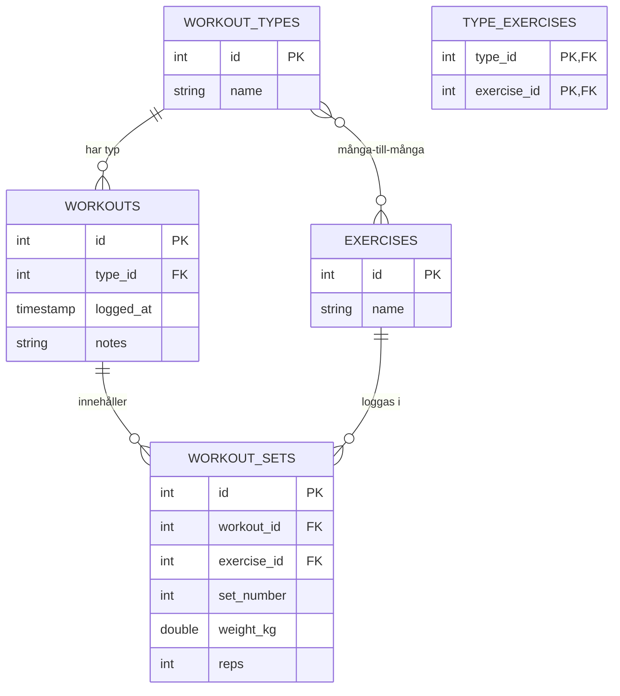

[Link for the website: mafendo.github.io/WorkOutTrack](https://mafendo.github.io/WorkOutTrack/)
## Databasstruktur

```mermaid
erDiagram
    WORKOUT_TYPES ||--o{ WORKOUTS : "har typ"
    WORKOUT_TYPES }o--o{ EXERCISES : "många-till-många"
    WORKOUTS ||--o{ WORKOUT_SETS : "innehåller"
    EXERCISES ||--o{ WORKOUT_SETS : "loggas i"

    WORKOUT_TYPES {
        int id PK
        string name
    }

    EXERCISES {
        int id PK
        string name
    }

    TYPE_EXERCISES {
        int type_id PK, FK
        int exercise_id PK, FK
    }

    WORKOUTS {
        int id PK
        int type_id FK
        timestamp logged_at
        string notes
    }

    WORKOUT_SETS {
        int id PK
        int workout_id FK
        int exercise_id FK
        int set_number
        double weight_kg
        int reps
    }
```
